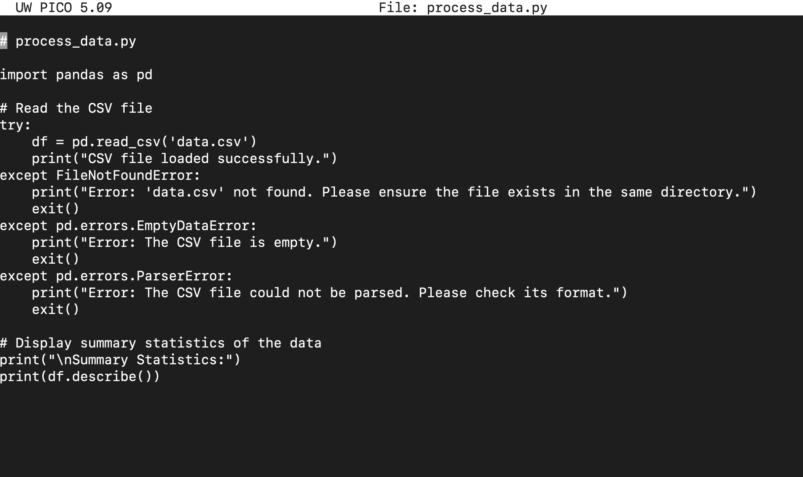
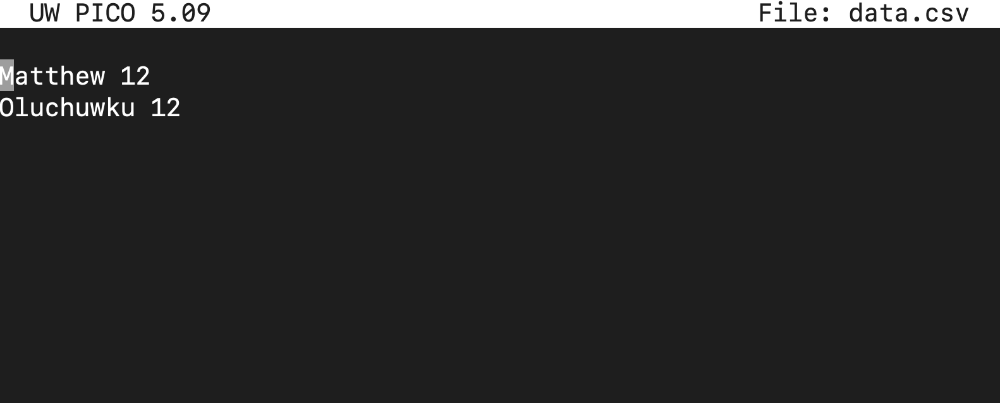
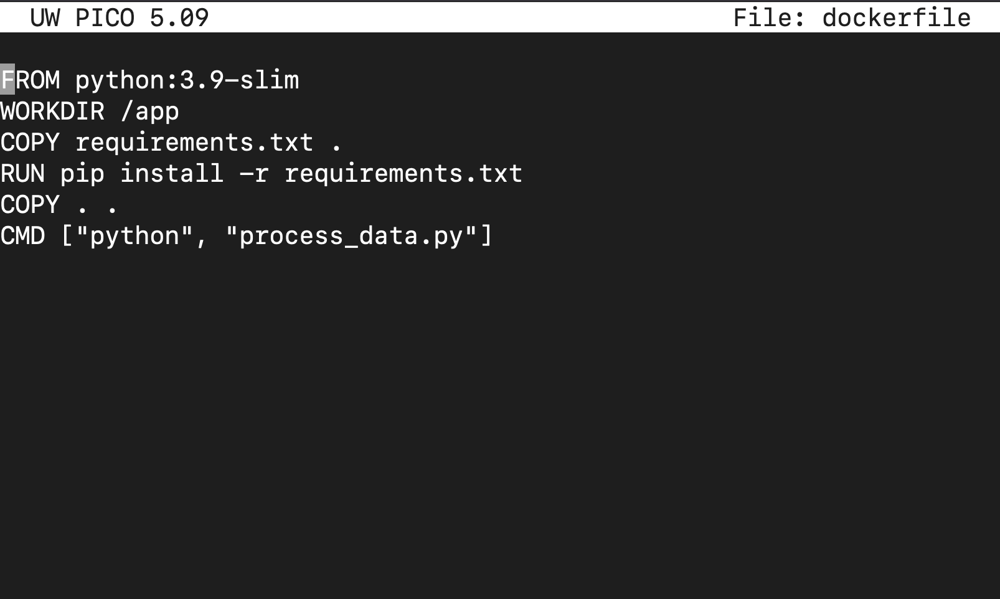

# my_second_docker_project.

# Dockerizing a Python Script: Step-by-Step Guide.

Dockerizing a Python script allows you to create a consistent and isolated environment for your code, regardless of where it's run. In this guide, we will cover the basics of Dockerizing a Python script, from creating a simple Python script that processes data from a CSV file using the pandas library to building and running it within a Docker container.

Containers are essential in modern software development, especially in DevOps, where we aim to streamline deployment and make applications portable and scalable. Docker is the go-to tool for containerization. 

Prerequisites:
- Basic understanding of Docker and Python.
- Docker installed on your machine (Install Docker).
- A sample Python script to work with.

#

**1. Create your working environment.**

`mkdir docker-project-2`

`cd docker-project-2`

**2. Setting Up a Simple Python Script.**

`nano process_data.py`

**3. Create a CVS file.**

`nano data.cvs`

**4. Create a Dockerfile.**

The Dockerfile is a text document that contains all the commands needed to assemble the Docker image. 
This file tells Docker how to set up the environment in which our script will run.
Create a file named Dockerfile in the same directory `process_data.py`

`nano dockerfile`

**Here's a breakdown of each line:*
- FROM: Specifies the base image to use for the container. We're using Python 3.9 (the slim version is a smaller, minimal image).
- WORKDIR: Sets the working directory in the container to /app.
- RUN: Installs Python dependencies
- COPY: Copys the project files into the container
- CMD: Defines the command that runs when the container starts - in this case, it will run. process_data.py

**5. Create a requirements.txt file.**

The requirements.txt file specifies the Python dependencies required by the script:

`nano requirements.txt`

